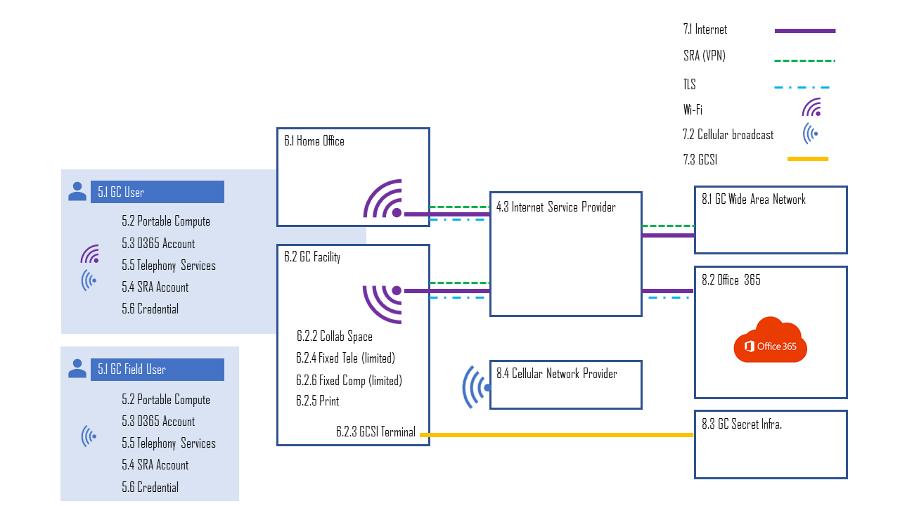

Hybrid Work (office + remote) Reference Architecture
====================================================

<h1>Table of Contents</h1>

[1. Purpose](#purpose)

[2. Context](#context)

[3. Policy References](#policy_references)

[4. Reference Architecture Overview](#ref_arch_overview)

[5. User Technology](#user_technology)

> [5.1. GC User vs GC Field User](#gc_user)
>
> [5.2. Portable Compute Device](#portable_compute)
>
> [5.3. Office 365 Account](#office_365_account)
>
> [5.4. GC Secure Remote Access Account](#gc_sra)
>
> [5.5. Telephony Services](#telephony_services)
>
> [5.6. Internal Credential](#internal_credential)

[6. Facility Technology](#facility_technology)

> [6.1. Home Office (remote)](#home_office)
>
> [6.2. GC Facility](#gc_facility)
>
> [6.2.1. Workpoints](#workpoints)
>
> [6.2.2. Collaboration Spaces](#collaboration_spaces)
>
> [6.2.3. GCSI Terminal (optional)](#gcsi_terminal)
>
> [6.2.4. Fixed Line Telephones (limited/optional)](#fixed_line)
>
> [6.2.5. Printer Devices](#printer_devices)
>
> [6.2.6. Fixed Compute Devices (limited/optional)](#fixed_compute)

[7. Networking](#networking)

> [7.1. Commercial Internet](#commercial_internet)
>
> [7.2. Cellular network (optional)](#cellular-network-optional)
>
> [7.3. GCSI (optional)](#gcsi)

[8. External, Supporting, Services](#external_supporting_services)

> [8.1. GC Wide Area Network (GC WAN)](#gc_wan)
>
> [8.2. Office 365](#office_365)
>
> [8.3. GC Secret Infrastructure (GCSI)](#gc_secret_infrastructure)
> 
> [8.4. Cellular Network Provider](#cellular_network_provider)

# 1. Purpose 

The purpose of this document is to provide guidance to departments and agencies on the technology that should be deployed to hybrid work (remote + GC offices) and further articulate the technology aspects of the [Directive on Service and Digital](https://www.tbs-sct.canada.ca/pol/doc-eng.aspx?id=32601).

# 2. Context

The pandemic has ushered in a shift in where and how GC employees and consultants work. For some, pre and post-pandemic work arrangements will not change as they are required to work on-site. For the majority or the GC's workforce, a hybrid work arrangement is not only possible, but has become a widespread practice. Supporting a hybrid work arrangement relies heavily on digital tools to support communication and collaboration. An employee is not longer expected to have a one-to-one relationship with an assigned deck in an office. Instead, an employee may work from home, GC co-working sites, GC workspace (multiple departments sharing one facility), and travelling. To support a hybrid arrangement, user technology must be:

-   Untethered by being connected to a wireless network, or easily disconnected and reconnected to a wired network.

-   Portable by being easily carried by the user between locations.

The GC's collaboration space is the Office 365 cloud-based service. Users (consultants and employees) are all connecting to GC services from the internet. The general trend is data gravity is tipping towards the internet.

Finally, the growing implementation of zero-trust architectures (ZTA) in technology. Amongst other things, ZTA allows for sensitive data to traverse untrusted networks.

These forces require that the GC have a recognized reference architecture for its user and facilities-based technologies that supports digital, hybrid, work arrangements.

# 3. Policy References

The Directive on Service and Digital contains two Standards that articulate the technology users and facilities must have to support a digital workspace. This document is guidance to departments and agencies to understand how those standards should be used in the context of a reference architecture to support hybrid work arrangements.

Standard on Information Technology User and Workpoint Profiles

[https://www.tbs-sct.canada.ca/pol/doc-eng.aspx?id=32601](https://www.tbs-sct.canada.ca/pol/doc-eng.aspx?id=32601)

Standard on Information Technology Provisions

[https://www.tbs-sct.canada.ca/pol/doc-eng.aspx?id=32674](https://www.tbs-sct.canada.ca/pol/doc-eng.aspx?id=32674)

# 4. Reference Architecture Overview

Illustrated, the Hybrid Work Architecture is below.

# 5. User Technology

User technology is any technology assigned to a user and stays with the user. This technology, ideally, is portable and untethered.

## 5.1. GC User vs GC Field User

A GC User is recognized as working in one or more GC facilities or remotely from home. In contrast, the GC Field User does not work in any facility and is largely reliant on commercial cellular networks for connectivity. Aside from connectivity, the technology assigned the each type of user is similar with some possible variations.

## 5.2. Portable Compute Device

GC Users will have a portable compute device. The exact specifications are determined by the department or agency, but it must, at a minimum, have:

-   A camera

-   Speakers

-   Microphone

-   Wireless network connectivity (wi-fi for GC Users and Cellular network for GC Field User)

GC Field Users may have a more ruggedized compute device.

## 5.3. Office 365 Account

To support conferencing/collaboration service, email, file sharing, and other office automation capabilities, each user is provided, at a minimum, an E3 Office 365 subscription (account). When a GC user leaves a department or agency, their account must be inactivated.

## 5.4. Secure Remote Access Account

To provide Virtual Private Network account capabilities, each GC User is assigned a Secure Remote Access (SRA) account. This account provides the capability of a GC compute device to connect to the GC Wide Area Network over a commercial internet connection.

## 5.6. Telephony Services

Currently, the following telephony technologies are available:

-   Fixed-line where a device is in a fixed location with a wired, traditional, carrier connection from a tele-com provider.

-   Smartphone with a cellular network plan and wi-fi calling capabilities must be enabled. A data plan is typically included in this offering.

-   Cellphones which do not have advance compute capabilities like a smartphone, but provides voice and sometimes data capabilities.

-   Softphones are a Microsoft Team client with a Voice over Internet Protocol (VoIP) plan.

Smartphones must have wi-fi calling enabled and have the ability to join the wireless internet broadcasted in GC facilities and non-GC facilities

***NOTE:*** At the time of writing, smartphones are the preferred telephony technology with fixed-line phones being used in limited cases. A proposal is currently under consideration to make softphones (MS Teams client + VoIP plan) the preferred telephony technology.

## 5.7. Internal Credential

GC Users will be issued a GC credential to be used for authentication purposes.

# 6. Facility Technology

Facilities technology is technology that must be present in a work location to support user technology.

## 6.1. Home Office (remote)

The home is not a GC managed facility, but one that still requires technical capabilities for the employee. A commercial internet connection from a tele-com provider or, more recently, low earth orbit satellite provider, that can support streaming video, is a requirement.

Home offices may also receive a cellular network broadcast to support smartphone voice and data capabilities.

## 6.2. GC Facility

In many ways, from a technical point of view, a GC facility is a large-scale home office with the exception of optional GC Secret Infrastructure (GCSI) network and terminal technology.

### 6.2.1. Workpoints

Workpoints are for individual work and are typically instantiated as a desk or cubicle. In a hybrid work environment no technology should be fixed to the workpoint except in limited cases. Limited case may include, but not limited to:

-   Accommodation needs

-   Operational needs

-   Business continuity (e.g. a limited number of fixed telephone devices deployed in a facility as a back-up for cellphone or internet interruption)

### 6.2.2. Collaboration Spaces

Collaboration spaces, including traditional, conference rooms, will benefit from systems that allow multiple users within a space to collaborate with other users online. Collaboration spaces can often have dedicated devices and equipment to support multiple users collaborating with other users online. Those devices and equipment must be compatible with Microsoft Teams.

### 6.2.3. GCSI Terminal (optional)

For national security scenarios, where required, the GC Secret Infrastructure (GCSI) will be deployed into GC facilities. The decision to deploy GCSI in a GC facility is driven by the tenants' operational requirements.

### 6.2.4. Fixed Line Telephones (limited/optional)

For business continuity, operational need, or accommodating accessibility needs, fixed lines may be deployed in limited numbers in a GC facility.

### 6.2.5. Printer Devices

Print devices are deployed on a limited basis throughout a GC facility.

### 6.2.6. Fixed Compute Devices (limited/optional)

Fixed compute (desktops) are used in limited circumstances where

-   compute requirements exceed those available on a portable compute device

-   The fixed compute device supports static equipment such as for science or other connected devices

Since these devices are not portable and forces the user to be in a GC facility to be used, fixed compute should be used only when necessary. Portable compute remains the preferred choice.

# 7. Networking

This section describes the network options available to facilities and, by extension, the user's technology when in those facilities. With the exception of GCSI, both home and GC facilities have the same network options available.

## 7.1. Commercial Internet

With GC Secure Remote Access having been scaled to support the pandemic, there is no longer a need to bring the GC Wide Area Network (WAN) into GC facilities. Commercially available internet from Internet Service Providers is sufficient. In this way, from a technology perspective, the GC facility can be viewed as a scaled up home office. Using commercially available internet as the means to connect the user to GC WAN, through SRA, and internet services brings the GC closer to a full zero-trust deployment of services. This network architecture will support use cases categorised as non-national security (ie unclassified, Protected A, B, and C).

Commercial internet must be, to the maximum extent possible, deployed wirelessly and broadcast through-out the building. At a minimum, two SSIDs should be available. The first will restrict connectivity to GC devices and the second SSID will be for guest devices and be appropriately throttled. GC devices include compute devices, conferencing/collaboration devices, printers, and smartphones to support wi-fi calling.

## 7.2. Cellular network (optional)

Commercial cellular network may be broadcast from outside of the GC facility. Pico cells or in-facility cellular networks will no longer be deployed. In cases where cellular network performance is insufficient to support smartphones, wi-fi calling will be sufficient for supporting smartphones within GC facilities.

## 7.3. GCSI (optional)

For national security scenarios, where required, the GC Secret Infrastructure (GCSI) will be deployed into GC facilities. The decision to deploy GCSI in a GC facility is driven by the tenants' operational requirements.

# 8. External, Supporting, Services

## 8.1. GC Wide Area Network (GC WAN)

The GC WAN is the location of applications hosted within GC data centres. It is also the gateway for the GC SRA service. Connections to the GC WAN are over commercial internet with the addition of SRA (VPN).

## 8.2. Office 365

Supporting Office 365 accounts is the Office 365, public cloud-based, service. Office 365 is accessed over commercial internet using inverse split tunneling and TLS encryption to project all communication between the users' devices and the Office 365 service.

## 8.3. GC Secret Infrastructure (GCSI)

The GCSI is the location of secret applications and can only be accessed by GCSI terminals.

## 8.4. Internet Service Provider (ISP)

An ISP is a commercial entity, such as a tele-com or low earth orbit satellite provider, who provides access to the internet.

## 8.5. Cellular Network Provider

A cellular network provider is a commercial entity, such as a tele-com, who broadcasts a cellular signal.

  [1]: #purpose
  [2]: #context
  [3]: #policy-references
  [4]: #user-technology
  [5]: #gc-user-vs-gc-field-user
  [6]: #portable-compute-device
  [7]: #office-365-account
  [8]: #gc-secure-remote-access-account
  [9]: #telephony-services
  [10]: #internal-credential
  [11]: #facility-technology
  [12]: #home-office-remote
  [13]: #gc-facility
  [14]: #workpoints
  [15]: #collaboration-spaces
  [16]: #gcsi-terminal-optional
  [17]: #fixed-line-telephones-limitedoptional
  [18]: #printer-devices
  [19]: #fixed-compute-devices-limitedoptional
  [20]: #networking
  [21]: #commercial-internet
  [23]: #gcsi-optional
  [24]: #external-supporting-services
  [25]: #gc-wide-area-network-gc-wan
  [26]: #office-365
  [27]: #gc-secret-infrastructure-gcsi
  [28]: https://www.tbs-sct.canada.ca/pol/doc-eng.aspx?id=32601
  [29]: https://www.tbs-sct.canada.ca/pol/doc-eng.aspx?id=32674
  [30]: media/image1.png {width="6.270138888888889in" height="3.527083333333333in"}
